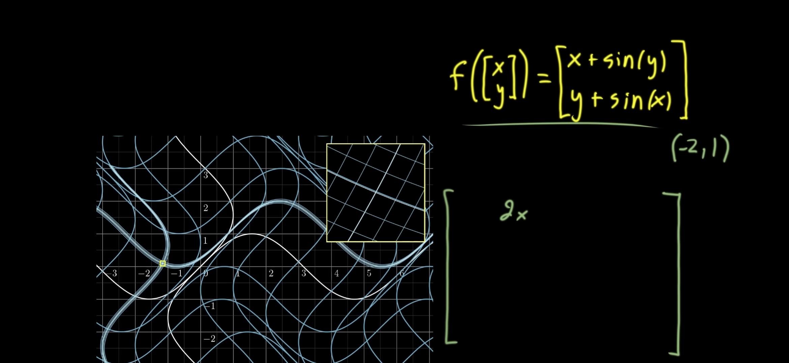
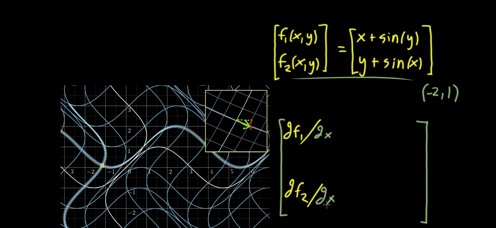
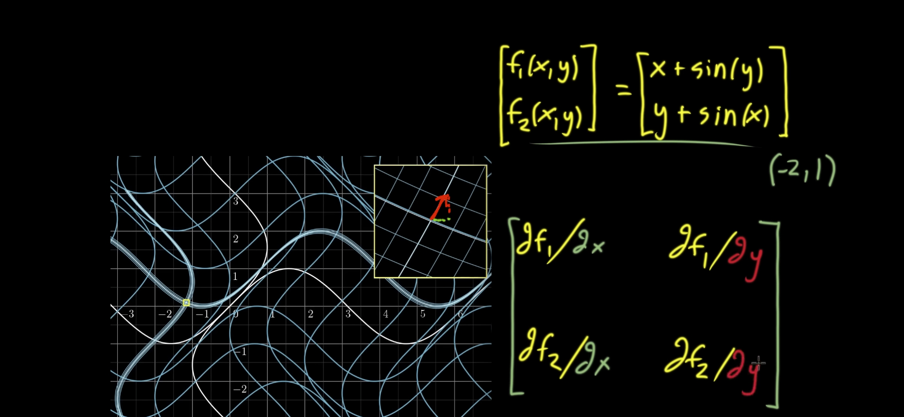

# Source: Local lineatity and the Jacobian matrix

Captured from 3 screenshots of a calculus visualization about zooming in on a multivariable transformation.

## Raw screenshots

Chronological order:

### Screenshot 01

### Screenshot 02

### Screenshot 03

## Extracted notes

- The Jacobian matrix describes what a multivariable transformation looks like when you zoom in near a specific point.
- For a tiny step in the input x direction, the output change has two components in output space.
- The same is true for a tiny step in the input y direction.
- Each entry of the Jacobian is a partial derivative.
- The first column tells how the outputs change when x changes a little.
- The second column tells how the outputs change when y changes a little.
- The Jacobian is the constant linear map that best approximates the original nonlinear transformation at the chosen point.
- In the example, the function is
  \[
  f\left(\begin{bmatrix}x\\y\end{bmatrix}\right)
  =
  \begin{bmatrix}
  x + \sin(y)\\
  y + \sin(x)
  \end{bmatrix}.
  \]
- The point highlighted in the screenshots is \((-2,1)\).
- The local linear picture turns a small neighborhood into a tilted, stretched grid rather than a curved one.
- The key idea is local linearity: nonlinear maps become nearly linear at very small scales.

## Open questions

- None from the screenshots.
