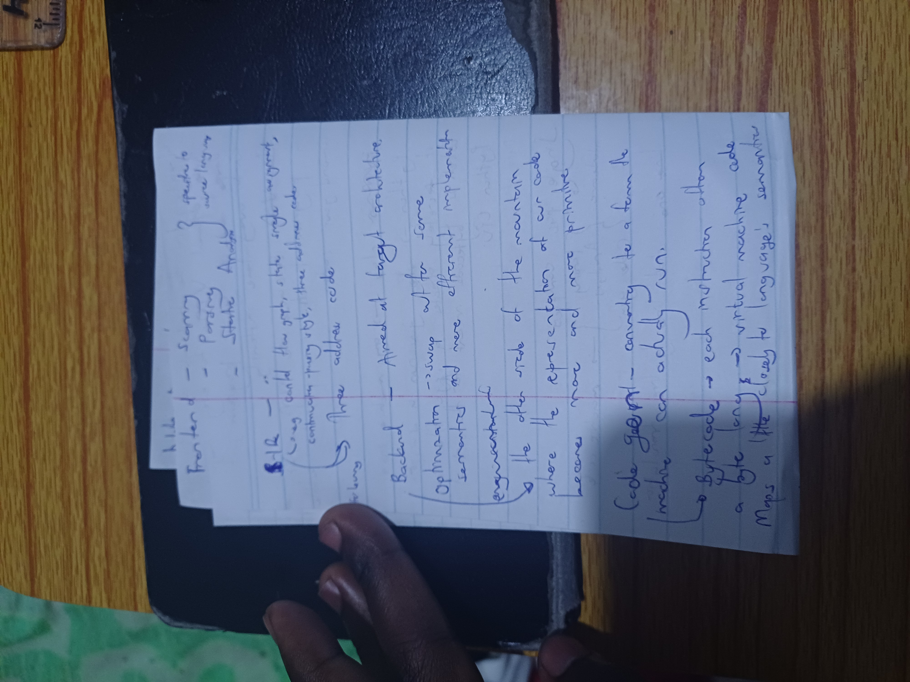
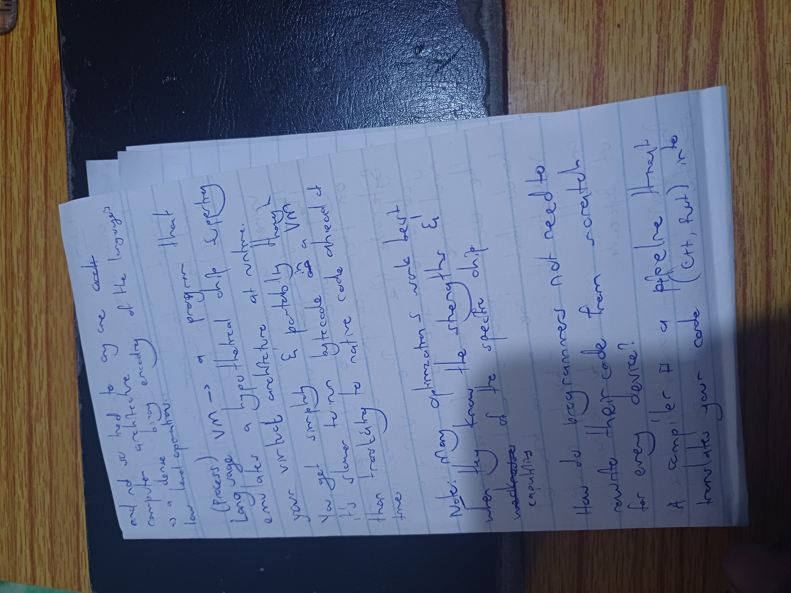
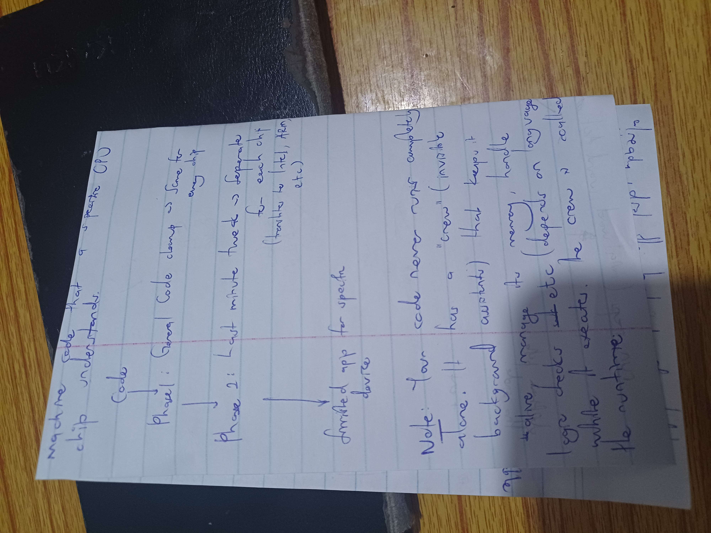
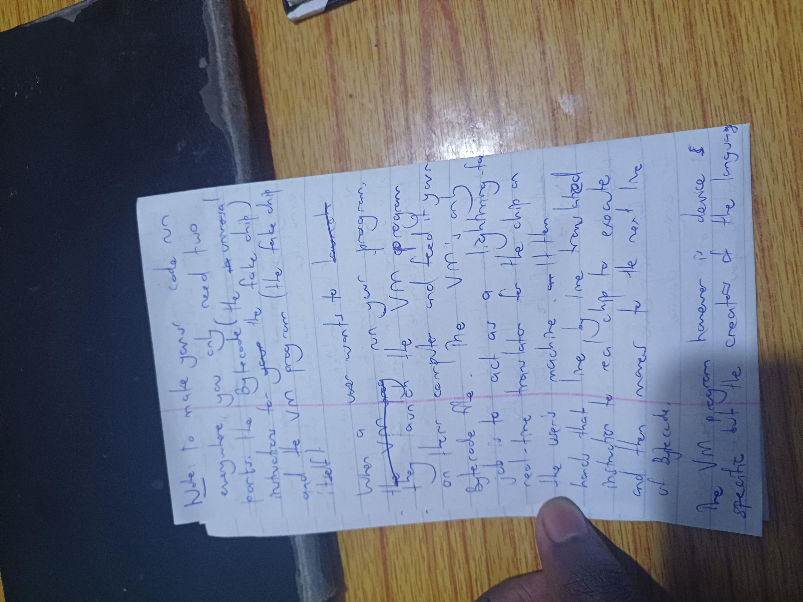
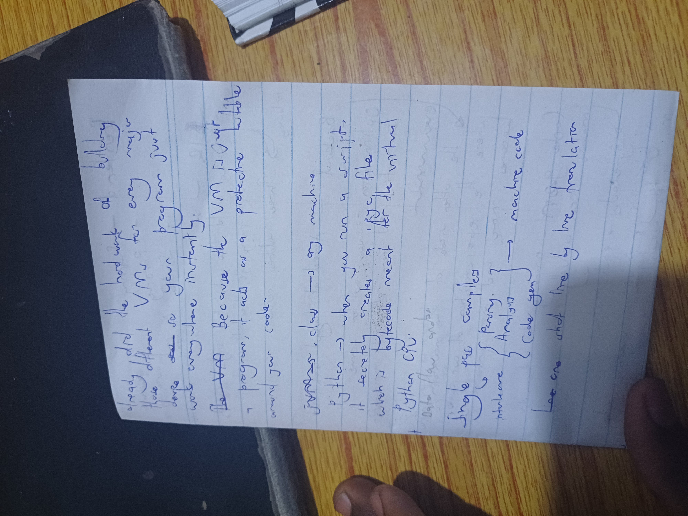
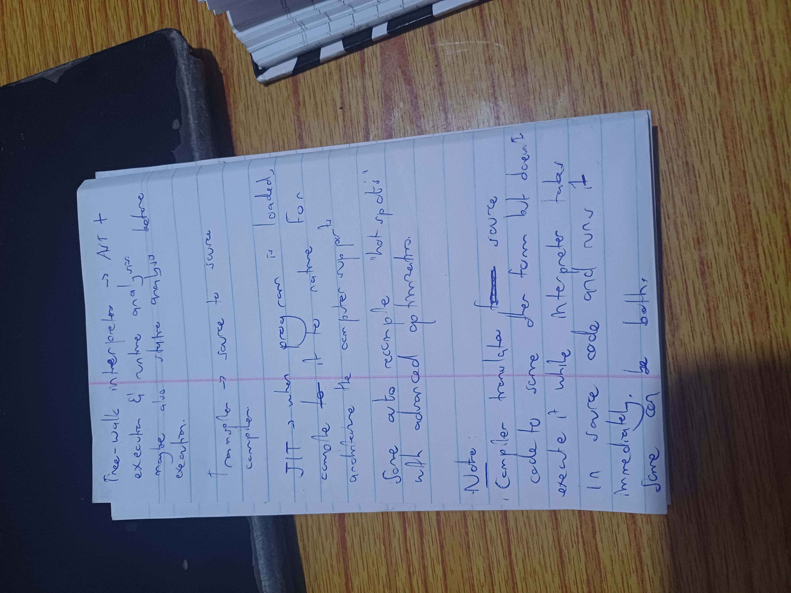

# 2026-05-29 — Compilers, Interpreters, and Virtual Machines

**Type:** Handwritten notes (7 pages)
**Topic:** How programming languages execute — compilers, interpreters, VMs, bytecode, JIT

## Pages

1. 
   - Compiler pipeline: Frontend → Backend → Optimization → Code gen
   - Bytecode, three-address code, virtual machine code
   - Frontend is source-language-specific

2. 
   - Language VM: a program that emulates a hypothetical chip
   - Optimizations work best when they know the strengths and weaknesses of the specific chip
   - A compiler is a pipeline that translates your code (C++, Rust) into...

3. 
   - Machine code, CPU
   - General code cleaning, last-minute tweaks
   - Your code never runs completely alone — it has a "crew" (invisible background assistants)

4. 
   - Fully compiled languages (Go): code gets inserted directly into the binary executable
   - Analogy: traveling with your own actors and crew vs. relying on local infrastructure
   - Java, Python, JavaScript need a permanent piece of software on the user's computer (JVM, Python interpreter)

5. 
   - To run code anywhere: need Bytecode + a VM program
   - VM program = "fake chip" acting as a lightning-fast translator
   - VM reads bytecode line-by-line and executes instructions
   - VM program is device-specific, language is not

6. 
   - The hard work of building different VMs for every major device
   - Java vs. Python: Python creates a .pyc file
   - Flowchart: Single pre-compile → parsing → analysis → code gen → machine code
   - One-shot line by line translation

7. 
   - JIT (Just-In-Time) compilation
   - Tree-walk interpreter
   - Transpiler
