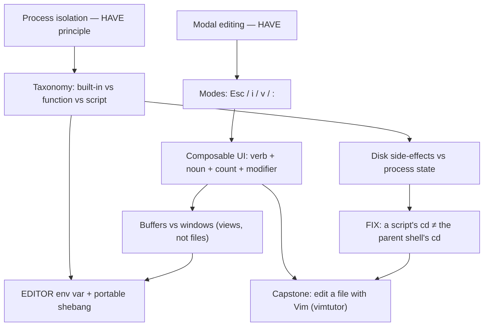

# Session — Development Environment & Tools — 2026-08-28

**Date:** 2026-08-28 · **Track:** SWE · **Type:** Lesson (B3 — curriculum row 3)

## Probe verdict

| Strand | State | Evidence |
|---|---|---|
| Vim — philosophy | solid | free-recall: "switch between insert / view / etc with a few keystrokes" ✅ |
| Vim — modes & keys | unknown (new) | A2 (`Esc`) correct but `hunch` |
| Shell — quoting | solid | B1 correct + `sure` |
| Shell — brace expansion | solid | B4 correct + `sure`; spot-check explained cross-product |
| Shell — special vars | unknown | B3 (`$$`=PID) correct but `hunch` |
| Shell — built-in/function/script | unstable (misconception) | free-recall + spot-check: thought a script's `cd` changes the parent shell |

## Plan (Mermaid, persisted)

## Verification

- **Fact-check subagent:** 7/7 load-bearing claims PASS (modal editor; composable
  verb/noun/count/modifier; buffers vs windows; function-in-shell vs script-in-process;
  cd-built-in reason; disk-vs-memory; EDITOR + env shebang).
- **Quiz-audit subagent:** probe batch passed after 2 cycles (2 low flags fixed:
  B2 Bloom over-tagged, correct-position slot-0 never used). End-of-lesson quiz
  batch — **audit subagent returned empty ×3 (backend failure)**; mechanical
  pre-checks + MCQ-integrity rules applied manually. **Not independently audited.**
- **Review-gate (lesson-end ingest):** pending at time of teaching — see note below.

## Quiz

First pass 3/6 (did not pass). Re-probe + final check closed the gap to
5/6-equivalent + Feynman pass. Misconception (script `cd`) recurred `sure` on the
both-effects item; recorded in Mistakes ledger (retry 2026-08-31).

## Feynman explain-back

**PASS.** Function runs in the parent process → can mutate shell state; script
runs in its own child → change can't propagate back. Analogy sharpened from
"errand boy not *allowed*" to "errand boy is in a *different building* (own
process), so he *can't* reach the home's furniture (shell memory)."

## Writes

- New Active Concepts rows: Vim Modal Editing, Vim Composable Commands, Vim
  Buffers & Windows (all `developing`, last_reviewed 2026-08-28, next_review +3d).
- Attempts.json: 3 new entries; recorded passes on Bash Quoting, Wildcards &
  Globs (probe `sure`), Shell Built-ins & Process Isolation (Feynman pass),
  What is the Shell.
- Mistakes ledger: 3 new rows (process-isolation disk-vs-memory; Vim `c`=change;
  Vim `i`=inside vs `t`=until), each retry 2026-08-31.

## Open questions (wonder-out)

- How far can "composable verbs" go — what's the Vim macro that turns a repeated
  multi-step edit into one keystroke? (bridges to B4 debugging automation)
- `set -o vi` vs a full modal editor: where does "Vim in the shell" earn its keep?

## Next due

- 2026-08-31: Vim Modal Editing, Vim Composable Commands, Vim Buffers & Windows
  first review; 3 mistake retries.
- Curriculum: B4 — Debugging and Profiling next.

## Deferred / handoffs

- **Wiki pages** for the 3 Vim concepts are a pending **Clerk ingest handoff**
  (not written inline, per routing: "do not write wiki pages yourself").
- **Lesson-end review-gate** on the 3 new Active Concepts rows to be run/folded
  in; see the review-gate result in the chat for the final verdict + any fixes.
